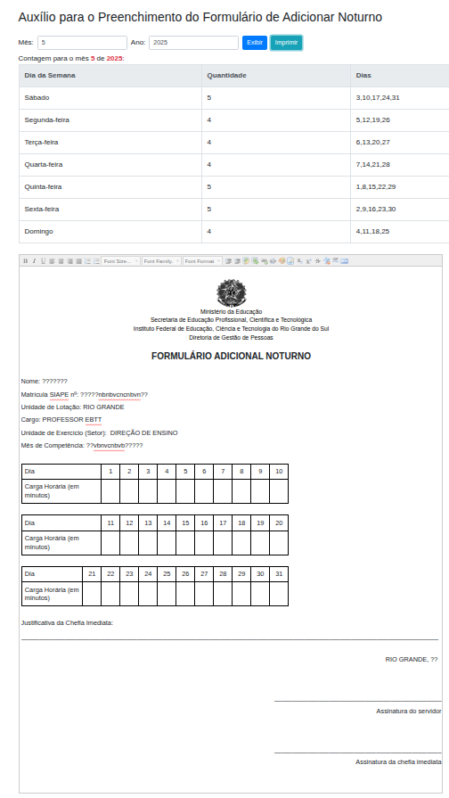

# AuxilioFormAdicionalNoturno
Auxílio para o Preenchimento do Formulário de Adicionar Noturno (IFRS)

Coloque o mês e o ano desejado e veja a quantidade e quais são os dias de cada dia de semana.

Depois preencha corretamente o formulário de acordo com quais dias você pode solicitar o adicional, e clique em *imprimir*. Salve em *pdf* e encaminhe para o setor responsável.

E está feito!

